<div align="center">


# RESILIENCE HUB

**A retrieval-augmented (RAG) assistant over your own resilience notes and challenges—Flask orchestrates Gemini + Pinecone; a small web client captures text and talks to the API.**

<p align="center">
  
  
  
  
</p>
<p align="center">
  
  
  
  
  
  
</p>

</div>

---

## Table of contents

- [What this project is](#what-this-project-is)
- [RAG and backend architecture](#rag-and-backend-architecture)
- [Capabilities](#capabilities)
- [Tech stack](#tech-stack)
- [Local setup](#local-setup)
- [Available scripts](#available-scripts)
- [Environment variables reference](#environment-variables-reference)
- [Deployment](#deployment)

---

## What this project is

**Resilience Hub** is built around a **Python Flask API** that powers **RAG-style** assistance: user-authored challenge text and journal notes are **embedded**, **indexed in Pinecone**, and **retrieved at query time** so **Google Gemini** can answer with grounded snippets instead of generic advice. The same service verifies Firebase ID tokens, reads structured **Firestore** facts for the signed-in user, applies **rate limits** on expensive routes, and exposes **embed**, **Pinecone upsert/delete**, and **chat** endpoints (`app.py`, `server/routes/`).

A **React (Vite) client** is included mainly as a shell to authenticate, edit challenges and notes, call `/api/*`, and render chat—but the **interesting systems work is server-side**: retrieval intent, vector search, prompt assembly, and model calls.

## RAG and backend architecture

Backend RAG at a glance: **indexing** (embed → upsert/delete in Pinecone) and **chat** (auth → Firestore facts → optional retrieval → one prompt → Gemini).

```mermaid
flowchart TB
  subgraph Indexing["Indexing path — vector writes"]
    U1["Challenge / note text from client"]
    U1 --> E1["POST /api/embed"]
    E1 --> G1["Gemini embedding model\nserver-side only"]
    G1 --> U2["POST /api/upsert-pinecone"]
    U2 --> PC["Pinecone index\nvectors scoped per user"]
    U3["POST /api/delete-pinecone"]
    U3 --> PC
  end

  subgraph Chatpath["Chat path — retrieval + generation"]
    CA["POST /api/chat-assistant\nAuthorization: Firebase ID token"]
    CA --> V["Verify token + email / rate limits"]
    V --> FS["Firestore users/{uid}\nassistant_facts → prompt context"]
    FS --> R{"needs_semantic_retrieval\nintent_chat.py"}
    R -->|yes| EM["Embed user message\nGemini"]
    EM --> PQ["Pinecone query\ntop-K, user_id filter"]
    PQ --> PR["_build_system_prompt\nrules + facts + RAG block + history"]
    R -->|no| PR
    PR --> GM["generate_chat_reply\ngemini_client.py"]
    GM --> OUT["JSON: assistant reply + meta\nragRequested, usedRag, …"]
  end
```



1. **Indexing path**: The client sends text to Flask **`/api/embed`** (Gemini embeddings on the server), then **`/api/upsert-pinecone`** so vectors land in a **per-user** Pinecone namespace; **`/api/delete-pinecone`** removes vectors when content is deleted.
2. **Chat path**: **`/api/chat-assistant`** (`server/routes/chat.py`) verifies the Firebase bearer token, builds **structured context** from Firestore (`server/assistant_facts.py`), and when **`needs_semantic_retrieval`** says the question needs note-level grounding, runs **embed + Pinecone query** (`_pinecone_matches_for_user`) for top-k chunks. Retrieved text is merged into the prompt; **Gemini** generates the reply (`server/gemini_client.py`).
3. **Safety and ops**: **Token-bucket rate limits** protect Pinecone, embed, and chat routes; **CORS** is origin-locked for credentialed browser calls; **`GEMINI_API_KEY`** and **`PINECONE_API_KEY`** never ship in frontend env vars.

For a fuller step-by-step (prompt layers, RAG vs no-RAG), see [`docs/chat-assistant-flow.md`](docs/chat-assistant-flow.md).

If Pinecone or the API is down, **Firestore-backed tracking** in the client can still operate; **RAG enrichment** is the optional upgrade path.

## Capabilities

- **RAG assistant**: Semantic retrieval over your notes/challenges + Gemini chat, with Firestore-backed “facts” in the same prompt.
- **Vector lifecycle**: Upsert and delete vectors via Flask blueprints; index name and API keys are server-only secrets.
- **AuthN for APIs**: Bearer Firebase tokens and Admin SDK checks (e.g. email verification) on protected routes.
- **Rate limiting & CORS**: Production-oriented controls on embedding, Pinecone, and chat traffic.
- **Dashboard weather**: Authenticated `/api/weather` proxy for current Open-Meteo conditions, driven by browser geolocation and rendered as best-effort dashboard context.
- **Resilience tracking (product layer)**: Timed challenges, day logging, daily reflections, and history—data in Firestore; text mirrored into the vector index for retrieval.
- **Static client**: React + TypeScript SPA used to drive the product and call the API; PWA packaging is secondary to the backend story.

## Tech stack

| Layer | Technology |
|------|------------|
| **RAG & LLM** | Google Gemini (chat + embeddings), retrieval over Pinecone |
| **API** | Flask 3, Flask-CORS, Gunicorn (production), route modules under `server/routes/` |
| **Vectors & metadata** | Pinecone client; Firebase Admin + **Cloud Firestore** for user data and assistant facts |
| **Client (thin)** | React 18, TypeScript, Vite, MUI — consumes `/api` and Firebase Auth in the browser |

## Local setup

### 1. Clone the repository

```bash
git clone <repository-url>
cd resilience-hub
```

### 2. RAG backend (Flask)

This is what serves **embed**, **Pinecone**, and **chat** (`http://localhost:5001` by default; root responds with a short **“RAG backend”** status string).

```bash
python3 -m venv .venv
source .venv/bin/activate   # Windows: .venv\Scripts\activate
pip install -r requirements.txt
```

Create or extend a **`.env`** in the project root (`app.py` loads it via `python-dotenv`):

```env
GEMINI_API_KEY=
PINECONE_API_KEY=
PINECONE_INDEX_NAME=
```

Then:

```bash
python -m server.app
```

Health check: `http://localhost:5001/api/test` (or `/` for the plain status message).

### 3. Web client (optional, for the full UI)

```bash
npm install
cp .env.example .env
# Fill VITE_* Firebase keys so auth and Firestore work in the browser.
```

Set **`GEMINI_API_KEY` only in the backend `.env`** — never in `VITE_*`. Do not commit `.env`.

```bash
npm run dev
```

Vite defaults to **5173** and proxies **`/api`** to **`http://localhost:5001`** (`vite.config.ts`) so the SPA talks to your local RAG API.

## Available scripts

**Backend**

- `python app.py` — Flask dev server for the RAG API (after activating `.venv` and installing `requirements.txt`)

**Client**

- `npm start` / `npm run dev` — Vite development server
- `npm run build` — TypeScript check + production build to `dist/`
- `npm run preview` — Preview the production build locally
- `npm run lint` — ESLint
- `npm run lint:fix` — ESLint with auto-fix
- `npm run lint:watch` — ESLint in watch mode
- `npm run server:dev` — Flask API (`python -m server.app` via `.venv`)
- `npm test` / `npm run test:run` — Vitest unit tests (`tests/frontend/`)
- `npm run test:server` — Flask/Python `unittest` (`tests/backend/`; uses `.venv/bin/python` like `server:dev`, from repo root)
- `npm run e2e` — Playwright smoke tests (`tests/e2e/`)

Automated tests live under **`tests/`**: `tests/frontend` (Vitest), `tests/backend` (Python), `tests/e2e` (Playwright).

More detailed flows live in **`docs/`** (for example `docs/chat-assistant-flow.md`, `docs/daily-reflections.md`, `docs/push-reminders.md`, and `docs/weather-dashboard.md`).

## Environment variables reference

**Frontend (Vite — `VITE_*` is exposed to the browser):**

```env
VITE_FIREBASE_API_KEY=
VITE_FIREBASE_AUTH_DOMAIN=
VITE_FIREBASE_PROJECT_ID=
VITE_FIREBASE_STORAGE_BUCKET=
VITE_FIREBASE_MESSAGING_SENDER_ID=
VITE_FIREBASE_APP_ID=
VITE_API_BASE_URL=
VITE_BASE_PATH=
```

**`VITE_API_BASE_URL`**: Cloud Run URL for the Flask RAG API (no trailing slash). Leave empty locally so `/api` uses the Vite proxy.

**`VITE_BASE_PATH`**: Public path when not hosted at domain root (e.g. `/resilience-hub/` for GitHub Pages project sites). Leave empty for local dev.

**Backend (Flask — server-side only, not prefixed with `VITE_`):**

```env
PINECONE_API_KEY=
PINECONE_INDEX_NAME=
# Used by /api/embed and /api/chat-assistant. Server-side only; never add a `VITE_` prefix to this.
# The server also accepts GOOGLE_API_KEY as a fallback name (see server/gemini_client.py).
GEMINI_API_KEY=
# Optional: restrict CORS in production (comma-separated). Required for credentialed browser requests from a real origin (e.g. GitHub Pages).
# When unset, defaults to http://localhost:5173 (dev only) — set this for any non-local deploy.
# ALLOWED_ORIGINS=https://YOURNAME.github.io/resilience-hub,http://localhost:5173
# Optional: tune token buckets used by expensive endpoints:
# - /api/upsert-pinecone, /api/delete-pinecone, /api/embed, /api/push/register
# - /api/chat-assistant (Gemini + optional Pinecone RAG)
# PINECONE_RATE_CAPACITY=30
# PINECONE_RATE_REFILL_PER_SEC=5
# EMBED_RATE_CAPACITY=60
# EMBED_RATE_REFILL_PER_SEC=5
# CHAT_UID_RATE_CAPACITY=3
# CHAT_UID_RATE_REFILL_PER_SEC=0.5
# CHAT_IP_RATE_CAPACITY=10
# CHAT_IP_RATE_REFILL_PER_SEC=1
```

Never commit secrets; use `.env.example` as the template only.

## Deployment

The **RAG API** is deployed as its own container (**`Dockerfile`** at the repo root builds `app.py` + `server/`). The **static SPA** is a separate deployment (GitHub Pages, Firebase Hosting, etc.) and must point **`VITE_API_BASE_URL`** at that API in production.

### Google Cloud Run (Flask RAG API)

The **`Dockerfile`** builds only the Python API. Below is what **you** need on your side, then a typical deploy flow.

#### What you need

1. **Google account** with a **GCP project** and [**billing enabled**](https://cloud.google.com/billing/docs/how-to/modify-project) (Cloud Run’s free tier still usually requires a billing account).
2. **APIs turned on** (the console prompts you, or enable manually): **Cloud Run**, **Artifact Registry**, **Cloud Build**.
3. [**Google Cloud SDK**](https://cloud.google.com/sdk/docs/install) (`gcloud`) installed locally, then:
   - `gcloud auth login`
   - `gcloud config set project YOUR_PROJECT_ID`
4. **Secrets for the service**
   - **`GEMINI_API_KEY`**, **`PINECONE_API_KEY`**, and **`PINECONE_INDEX_NAME`**. Prefer [Secret Manager](https://cloud.google.com/secret-manager) for API keys; at minimum set them as Cloud Run env vars in the console or via `--set-env-vars` (avoid logging them).
5. **CORS**: The browser sends **cookies/credentials** with some `/api` calls. That **does not work** with `Access-Control-Allow-Origin: *`. Set **`ALLOWED_ORIGINS`** on the service to your real site origins, comma-separated, e.g. `https://YOURNAME.github.io`, `https://YOURNAME.github.io/resilience-hub`, and `http://localhost:5173` for local testing.
6. **Frontend URL**: Set **`VITE_API_BASE_URL`** in the static build to your Cloud Run origin (no trailing slash). The app uses it for all `/api/...` calls when not same-origin.

#### Deploy from your machine (source build)

From the **repository root** (where `Dockerfile` lives):

```bash
gcloud run deploy resilience-hub-api \
  --source . \
  --region us-central1 \
  --allow-unauthenticated \
  --set-env-vars "PINECONE_INDEX_NAME=your-index-name,ALLOWED_ORIGINS=https://YOURNAME.github.io"
```

Add **`PINECONE_API_KEY`** (and **`GEMINI_API_KEY`**) via the Cloud Run UI, or `--set-secrets` once secrets exist in Secret Manager, for example:

```bash
echo -n 'YOUR_PINECONE_KEY' | gcloud secrets create pinecone-api-key --data-file=-
gcloud run deploy resilience-hub-api \
  --source . \
  --region us-central1 \
  --allow-unauthenticated \
  --set-env-vars "PINECONE_INDEX_NAME=your-index-name,ALLOWED_ORIGINS=https://YOURNAME.github.io" \
  --set-secrets "PINECONE_API_KEY=pinecone-api-key:latest"
```

Replace **`us-central1`**, service name, index name, and origins with yours. First deploy may take several minutes while Cloud Build creates the image.

Smoke test: `curl -sS "https://YOUR-SERVICE-URL/api/test"`.

### GitHub Pages (static client)

Static hosting uses [**GitHub Actions**](.github/workflows/deploy-pages.yml): build output is uploaded to Pages (**source: GitHub Actions** in repo settings).

1. **Settings → Pages → Build and deployment** — set **Source** to **GitHub Actions**.
2. **Settings → Secrets and variables → Actions**
   - **Secrets**: `VITE_FIREBASE_API_KEY`, `VITE_FIREBASE_AUTH_DOMAIN`, `VITE_FIREBASE_PROJECT_ID`, `VITE_FIREBASE_STORAGE_BUCKET`, `VITE_FIREBASE_MESSAGING_SENDER_ID`, `VITE_FIREBASE_APP_ID`, `VITE_FIREBASE_VAPID_KEY`. (`GEMINI_API_KEY` lives only on the Flask backend — never add it as a `VITE_*` build secret, since `VITE_*` values are inlined into the public JS bundle.)
   - **Variables**: `VITE_API_BASE_URL` = Cloud Run service URL (no trailing slash).
3. **Cloud Run**: set **`ALLOWED_ORIGINS`** to `https://YOUR_USER.github.io,https://YOUR_USER.github.io/YOUR_REPO,http://localhost:5173` (adjust user/repo).
4. **Firebase → Authentication → Authorized domains**: add **`github.io`**.
5. Push to **`main`**, or run the workflow manually.

The workflow sets `VITE_BASE_PATH` to `/<repo>/` automatically. Local subpath check:

```bash
VITE_BASE_PATH=/resilience-hub/ npm run build && npm run preview
```

### Firebase Hosting (static client)

1. Install the CLI: `npm install -g firebase-tools`
2. Log in: `firebase login`
3. If needed: `firebase init hosting` — public directory **`dist`**, SPA **yes**, do not overwrite `index.html` if prompted to keep your entry.
4. Build: `npm run build`
5. Deploy: `firebase deploy`

The live URL will look like `https://<your-project-id>.web.app`.

If the API is on **Cloud Run**, set **`ALLOWED_ORIGINS`** on the backend and **`VITE_API_BASE_URL`** in the frontend build (GitHub Actions variable or local `.env`).
