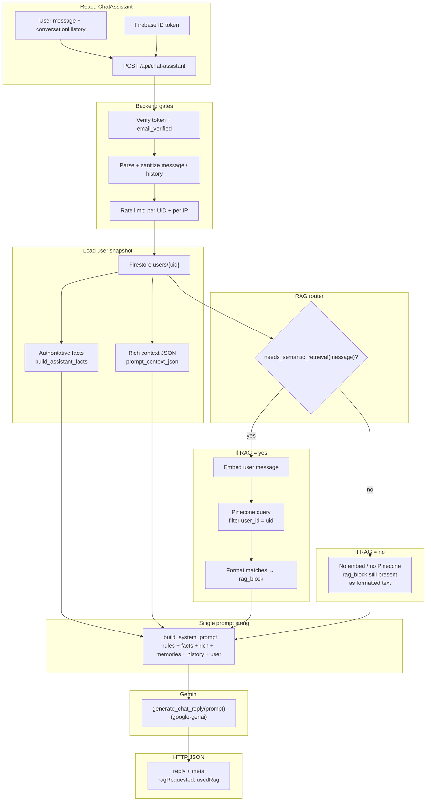
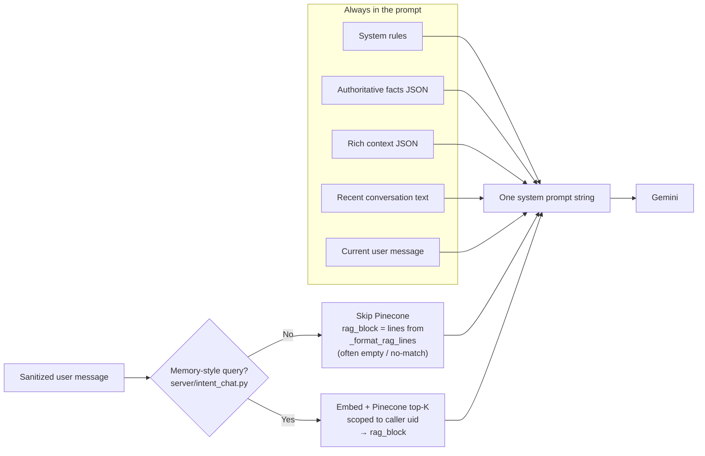

# Chat assistant: end-to-end flow

Single-page reference for how the Resilience Hub chat assistant works: **frontend → Flask → Firestore / optional Pinecone → Gemini**, including **RAG vs no-RAG**, **what data enters the prompt**, and **how the backend assembles it**.

**Primary code:** `src/components/ChatAssistant.tsx`, `server/routes/chat.py`, `server/chat_context.py`, `server/assistant_facts.py`, `server/intent_chat.py`, `server/gemini_client.py` (Gemini calls use the **`google-genai`** Python SDK).

---

## 1. High-level architecture



**Vector writes (separate from this read path):** the app gets **768-dim embeddings** from **`POST /api/embed`** (server-side Gemini), then sends vectors to Pinecone via authenticated **`POST /api/upsert-pinecone`** (and deletes via **`/api/delete-pinecone`**). The chat route **reads** Pinecone only when RAG is selected (embed + query on the server).

---

## 2. RAG vs no RAG



| Path | `needs_semantic_retrieval` | Extra work | Effect on prompt |
|------|---------------------------|------------|-------------------|
| **No RAG** | `false` | No embedding call, no Pinecone query | **Retrieved memories** section has no real hits (still present as structured text). |
| **RAG** | `true` | Embed query → Pinecone query with `user_id` filter | **Retrieved memories** lists top-K snippets. |

**Prompt rules still apply:** counts and statistics must come from **Authoritative facts**, not from memories or rich context alone. Memories are for recall / themes; facts are for numbers and lists.

---

## 3. What the model receives (layers inside one string)

The backend builds **one large prompt** in `_build_system_prompt` (`server/routes/chat.py`). Conceptually:

```text
┌─────────────────────────────────────────────────────────────┐
│ 1. SYSTEM RULES                                            │
│    Safety, word limit, how to use facts vs rich vs RAG     │
├─────────────────────────────────────────────────────────────┤
│ 2. AUTHORITATIVE FACTS (JSON)                               │
│    build_assistant_facts(user_doc)                          │
├─────────────────────────────────────────────────────────────┤
│ 3. RICH CONTEXT (JSON)                                      │
│    prompt_context_json(user_doc)                           │
├─────────────────────────────────────────────────────────────┤
│ 4. RETRIEVED MEMORIES (text)                                │
│    From Pinecone when RAG runs; otherwise empty-style text  │
├─────────────────────────────────────────────────────────────┤
│ 5. RECENT CONVERSATION (text)                               │
│    Sanitized conversationHistory from the client            │
├─────────────────────────────────────────────────────────────┤
│ 6. USER MESSAGE (text)                                      │
│    Current turn, sanitized and length-capped                │
└─────────────────────────────────────────────────────────────┘
                          │
                          ▼
                   generate_chat_reply (Gemini, google-genai)
```

### Authoritative facts (what it is for)

Structured JSON from **`build_assistant_facts`** (`server/assistant_facts.py`): counts, active vs archived challenge lists, planned duration style fields, reflection-day style summaries, etc. This is the **source of truth for numeric / list questions**.

### Rich context (what it is for)

A **JSON string** from **`prompt_context_json`** (`server/chat_context.py`), built by **`build_prompt_context_payload`**. It includes:

- User **name**
- Up to **48** challenges, each with id, name, cadence, completed days, duration, **calendar window ended**, **challengeStatus** (active vs archived), and up to **12** per-challenge note **previews** (truncated)
- **`dailyNotesSummary`**: up to **14** recent dates with truncated note text

Use: **names, tone, recent wording, and narrative color** when RAG is off or incomplete. Not the primary source for strict counts (the prompt tells the model to follow facts for that).

### Retrieved memories (RAG block)

When RAG is on, **`_pinecone_matches_for_user`** embeds the user message, queries Pinecone, and **`_format_rag_lines`** turns matches into bullet lines. If Pinecone is misconfigured or errors, the route may return an empty match list and the block still renders as a safe placeholder.

---

## 4. Backend sequence (strict order)

Order inside **`chat_assistant`** (`server/routes/chat.py`):

1. Read **`Authorization`** header; **`verify_bearer_uid_and_email_verified`** → `uid`, `email_verified`.
2. If not verified → **`403`** `email_not_verified`.
3. Parse JSON body; require non-empty **`message`**; **`_sanitize_chat_payload`** for message and **`conversationHistory`**.
4. Derive client IP ( **`X-Forwarded-For`** first hop, else **`remote_addr`** ); apply **per-UID and per-IP** token-bucket rate limits → **`429`** `rate_limited` if exceeded.
5. **Firestore** `users/{uid}` → **`404`** `user_not_found` if missing.
6. **`build_assistant_facts(user_doc)`** and **`prompt_context_json(user_doc)`**.
7. **`needs_semantic_retrieval(message)`** → if true, **Pinecone path** (embed + query).
8. **`_build_system_prompt`** → single string.
9. Optional **logging** of prompt sizes / preview / full prompt (see `.env.example`: `CHAT_LOG_*`, `LOG_LEVEL`).
10. **`generate_chat_reply(prompt)`** → **`503`** `model_unavailable` on configured Gemini errors.
11. Return **`200`** JSON: **`reply`**, **`meta.ragRequested`**, **`meta.usedRag`**.

---

## 5. Response `meta` fields

| Field | Meaning |
|-------|--------|
| **`ragRequested`** | `needs_semantic_retrieval(message)` was **true** (router chose the RAG path). |
| **`usedRag`** | RAG was requested **and** at least one Pinecone match was returned (`use_rag and matches`). |

So: you can have **`ragRequested: true`** and **`usedRag: false`** if the index returned no rows or Pinecone was skipped due to missing env / failure (matches empty).

---

## 6. Frontend contract

**`ChatAssistant`** (`src/components/ChatAssistant.tsx`):

- Sends **`POST /api/chat-assistant`** with **`Authorization: Bearer <idToken>`**, JSON **`{ message, conversationHistory }`**, and **`credentials: 'include'`** on the `fetch` (aligned with Flask CORS `supports_credentials`).
- Client-side message length is capped to stay aligned with server limits; server still truncates defensively.

**UI-only protection:** routes like **`ProtectedRoute`** enforce sign-in and email verification in the SPA. **Enforcement for cost and abuse** is on the server (verified email, rate limits, auth).

---

## 7. Related environment variables (server)

See **`.env.example`** for the authoritative list. Commonly relevant for this flow:

- **`GEMINI_API_KEY`** — required for replies (and embeddings on the RAG path inside chat).
- **`PINECONE_API_KEY`**, **`PINECONE_INDEX_NAME`** — optional; without them, RAG query path tends to yield no matches.
- **`CHAT_UID_RATE_*`**, **`CHAT_IP_RATE_*`** — token buckets for `/api/chat-assistant`.
- **`CHAT_LOG_PROMPT_PREVIEW_CHARS`**, **`CHAT_LOG_FULL_PROMPT`**, **`LOG_LEVEL`** — prompt observability (treat full prompts as **sensitive**).

---

## 8. Automated tests

**`tests/backend/test_chat.py`** covers RAG routing heuristics (`needs_semantic_retrieval`), payload sanitization (`_sanitize_chat_payload`), and HTTP behavior for chat (auth **401**, unverified email **403**, rate limit **429**, missing message **400**) with mocks so CI does not call live Gemini or Firebase.

Run the full Python suite from the repo root (uses `.venv` like `server:dev`):

```bash
npm run test:server
```

Run only the chat test module:

```bash
.venv/bin/python -m unittest tests.backend.test_chat -v
```
