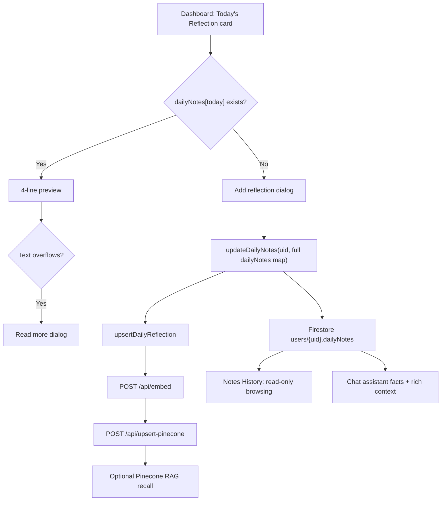

# Daily reflections flow

This page documents the "Today's Reflection" feature: a daily journal entry stored in Firestore, optionally mirrored into Pinecone for semantic recall, and summarized for the chat assistant.

**Primary code:** `src/pages/DashboardPage.tsx`, `src/pages/NotesHistoryPage.tsx`, `src/services/firestore.ts`, `src/services/pinecone.ts`, `src/utils/api.ts`, `server/chat_context.py`, `server/assistant_facts.py`, `server/routes/pinecone.py`, `tests/frontend/pages/DashboardPage.feature.test.tsx`.

## 1. End-to-end flow



1. `DashboardPage` derives `today` from the browser's local date key (`YYYY-MM-DD`) and reads `userData.dailyNotes?.[today]`.
2. Saving a reflection calls `updateDailyNotes(currentUser.uid, updatedDailyNotes)`. This writes the full `dailyNotes` object back to `users/{uid}` with an updated timestamp.
3. After Firestore succeeds, `upsertDailyReflection` embeds the text and posts a vector with `type: "reflection"` metadata. This mirror is best effort; failures are logged and should not block Firestore-backed UI.
4. The dashboard shows saved text as a collapsed 4-line preview. A `ResizeObserver` (or window resize fallback) enables the `Read more` dialog only when the preview overflows.
5. `NotesHistoryPage` lists historical reflections from the same `dailyNotes` map, newest first, with optional date-range filtering. It is browse/read-only for daily reflections.
6. The chat backend reads the Firestore snapshot on `/api/chat-assistant` and includes reflection facts plus a bounded recent-note summary in the prompt. Pinecone is used only when the RAG intent router selects semantic retrieval.

## 2. Firestore model

Daily reflections live on the user document:

```ts
type DailyNotes = Record<string, string>;

type User = {
  uid: string;
  name: string;
  challenges: Challenge[];
  dailyNotes: DailyNotes;
  timezone?: string;
};
```

Example:

```json
{
  "dailyNotes": {
    "2026-05-27": "Felt focused after taking a walk.",
    "2026-05-26": "Needed more sleep, but still completed the habit."
  }
}
```

Important constraints:

- Keys are local calendar dates formatted as `YYYY-MM-DD`.
- Values are plain strings. There is no per-reflection object, server-created ID, or stored Pinecone `vectorId`.
- `updateDailyNotes` replaces the whole `dailyNotes` map. Callers should merge with the current map before saving one day.
- `firestore.rules` allows the signed-in owner to write `dailyNotes`; server-only fields such as push reminder bookkeeping remain outside the client write allowlist.
- New and reset user flows initialize `dailyNotes` to `{}`.

## 3. UI surfaces

| Surface | File | Behavior |
|---------|------|----------|
| Today's Reflection card | `src/pages/DashboardPage.tsx` | Shows today's entry on the Active Challenges tab, with add/edit/delete actions for the current local day. |
| Add/edit dialog | `src/pages/DashboardPage.tsx` | Multiline text field with `id="daily-reflection"` and `name="dailyReflection"`. Saving persists Firestore first, then tries the Pinecone mirror. |
| Read more dialog | `src/pages/DashboardPage.tsx` | Full-text view for long current-day reflections when the 4-line preview overflows. |
| Delete today dialog | `src/pages/DashboardPage.tsx` | Removes only today's key from the Firestore map, then attempts best-effort Pinecone cleanup. |
| Delete all menu action | `src/pages/DashboardPage.tsx` | Sets `dailyNotes` to `{}` in Firestore. It does not currently delete matching Pinecone vectors. |
| Notes History page/tab | `src/pages/NotesHistoryPage.tsx` | Lists saved reflections by date and opens them in a read-only dialog. Past reflection edit/delete controls are not implemented here. |

`DashboardPage` polls for local date changes every 60 seconds. This keeps the "today" key current across midnight without requiring a page refresh.

## 4. Pinecone mirror

Daily reflections use the generic vector mutation API. The example below shortens the vector for readability; real requests must include 768 numbers.

```http
POST /api/upsert-pinecone
Authorization: Bearer <Firebase ID token>
Content-Type: application/json
```

```json
{
  "vector": [0.01, 0.02],
  "metadata": {
    "type": "reflection",
    "date": "2026-05-27",
    "content": "Felt focused after taking a walk.",
    "dateCreated": "2026-05-27T15:30:00.000Z"
  }
}
```

Route constraints from `server/routes/pinecone.py`:

- Vectors must be 768 numeric dimensions.
- The authenticated Firebase UID is the only ownership source; client-supplied user IDs are ignored by the route.
- Metadata is allowlisted and string metadata is truncated at 8000 characters.
- Vector IDs are generated as `{uid}-{type}-{challengeId}-{timestamp}`. For reflections, `challengeId` is empty, so IDs look like `{uid}-reflection--{timestamp}`.
- Deletes require either a caller-owned `vectorId` or a caller-owned `prefix`.

Operational notes:

- Firestore is the source of truth. The product should continue to work if `/api/embed`, Gemini, Pinecone, or `/api/upsert-pinecone` is unavailable.
- Re-saving a reflection creates a new Pinecone vector; because `dailyNotes` does not store a `vectorId`, the previous vector is not replaced in the current implementation.
- Deleting today's reflection attempts best-effort cleanup, but the dashboard currently sends a `vectorId` shaped as `reflection_${todayKey}`, which does not match the server-owned vector ID format. Treat Firestore deletion as authoritative.
- Delete-all daily reflections clears Firestore only. If stale reflection vectors matter for RAG behavior, add an explicit prefix cleanup flow such as a caller-owned `{uid}-reflection-` prefix delete.

## 5. Chat assistant consumption

The chat route has no reflection-specific HTTP endpoint. It reads `users/{uid}` and derives two prompt layers:

| Prompt layer | Source | Reflection fields |
|--------------|--------|-------------------|
| Authoritative facts | `build_assistant_facts` in `server/assistant_facts.py` | `dailyReflections.daysWithNote` and `dailyReflections.hasNoteToday` |
| Rich context | `build_prompt_context_payload` in `server/chat_context.py` | `dailyNotesSummary`, up to 14 recent non-empty entries truncated to 400 characters each |
| Retrieved memories | `server/routes/chat.py` Pinecone query path | Reflection vectors may appear when `needs_semantic_retrieval` routes the message to RAG |

Use facts for counts and yes/no questions such as "Did I write today?". Use rich context and RAG for narrative recall, themes, and wording from recent or semantically matched entries.

Timezone caveat: the dashboard uses the browser's local date for the `dailyNotes` key. The chat backend computes `todayLocal` from `users/{uid}.timezone` via `get_user_timezone_and_today`, defaulting to UTC if no timezone is stored. `AuthContext` best-effort syncs the browser timezone with `upsertUserTimezone`, but there can be a mismatch near midnight if that field is missing or stale.

## 6. Troubleshooting

- **Reflection saved in the UI but not found by RAG:** Check `/api/embed`, `/api/upsert-pinecone`, `GEMINI_API_KEY`, `PINECONE_API_KEY`, and `PINECONE_INDEX_NAME`. Firestore save can succeed while Pinecone mirroring is skipped.
- **Chat says there is no reflection today near midnight:** Compare the dashboard date key with `assistantFacts.todayLocal` and the stored `timezone` field.
- **Deleted reflections still appear in semantic recall:** Firestore deletion does not guarantee Pinecone deletion for reflections. Inspect vectors with `type: "reflection"` and the caller's `user_id` metadata.
- **One day's save removes another day's entry:** Confirm the caller merged into the existing `dailyNotes` object before calling `updateDailyNotes`, because the helper writes the entire map.

## 7. Tests

`tests/frontend/pages/DashboardPage.feature.test.tsx` covers:

- Saving today's reflection through `updateDailyNotes` and `upsertDailyReflection`.
- Using the refreshed local date when deleting after a date rollover.
- Deleting all daily reflection notes through the dashboard menu.

Run the focused frontend suite from the repository root:

```bash
npm run test:run -- tests/frontend/pages/DashboardPage.feature.test.tsx
```

