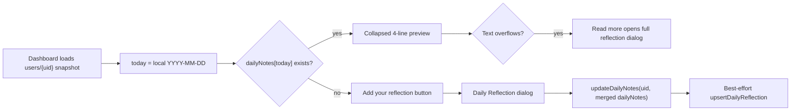

# Daily reflections

Daily reflections are free-form journal entries keyed by the user's local calendar date. They appear on the dashboard beside weather context, in Notes History, and in the chat assistant's structured context.

**Primary code:** `src/pages/DashboardPage.tsx`, `src/pages/NotesHistoryPage.tsx`, `src/services/firestore.ts`, `src/services/pinecone.ts`, `src/utils/embeddings.ts`, `server/routes/embed.py`, `server/routes/pinecone.py`, `server/chat_context.py`, `server/assistant_facts.py`, `tests/frontend/pages/DashboardPage.feature.test.tsx`.

## 1. Data model

Daily reflections live on the user's Firestore document:

```ts
type DailyNotes = Record<string, string>;

type User = {
  uid: string;
  name: string;
  challenges: Challenge[];
  dailyNotes: DailyNotes;
};
```

Keys are `YYYY-MM-DD` strings from `getLocalDateKey()` in `DashboardPage`, built with the browser's local date. Values are the raw reflection text. Challenge notes use a separate shape under `challenges[].notes`; daily reflections do not have per-entry `vectorId` fields in Firestore.

The save button does not currently trim or reject blank input. A blank save can leave an empty-string key in `dailyNotes`; dashboard display and `hasNoteToday` use truthiness, while `daysWithNote` counts string keys.

Example Firestore shape:

```json
{
  "uid": "user-123",
  "dailyNotes": {
    "2026-05-20": "Felt good. Stayed consistent.",
    "2026-05-19": "Harder day, but I noticed the trigger."
  }
}
```

## 2. Dashboard flow



Important behavior:

- `today` comes from `lastKnownDate`, which is refreshed by the dashboard date-change effect. Saves and deletes use that state rather than a module-level constant, so actions after midnight target the current local date.
- The card previews an existing reflection with a 4-line CSS clamp (`DAILY_REFLECTION_PREVIEW_LINE_CLAMP`). A `ResizeObserver` or window resize listener sets `dailyReflectionOverflows`; only overflowing text shows `Read more`.
- The full read dialog is UI-only. It renders `todayReflectionText` and closes automatically when either the local date key or reflection text changes.
- The dashboard also renders best-effort weather next to the reflection date. That weather flow is documented separately in `docs/weather-dashboard.md`.

## 3. Save, edit, and delete paths

### Save or edit today's reflection

`handleDailyNoteSubmit` merges the current text into `userData.dailyNotes` at today's key, calls `updateDailyNotes`, updates local React state, and then calls `upsertDailyReflection`.

Firestore is the source of truth. `upsertDailyReflection` is an optional Pinecone mirror:

1. `src/services/pinecone.ts` calls `embedTextToVector(reflection)`.
2. `embedTextToVector` POSTs to authenticated `POST /api/embed`.
3. `server/routes/embed.py` trims empty input, caps embedding input at 4000 chars, and returns a 768-dimensional vector from Gemini.
4. The client POSTs the vector and metadata to authenticated `POST /api/upsert-pinecone`.
5. `server/routes/pinecone.py` ignores client-supplied ownership, stamps `metadata.user_id` from the verified Firebase token, and generates an id shaped like `{uid}-{type}-{challengeId}-{timestamp}`.

Reflection upsert metadata currently includes:

```json
{
  "type": "reflection",
  "date": "2026-05-20",
  "content": "Felt good. Stayed consistent.",
  "dateCreated": "2026-05-20T15:01:25.000Z"
}
```

### Delete today's reflection

`handleDeleteDailyNote` copies `dailyNotes`, deletes today's key, writes the whole map with `updateDailyNotes`, updates local state, and then attempts best-effort Pinecone cleanup.

Current limitation: daily reflection Firestore entries do not store the Pinecone `vectorId` returned by `/api/upsert-pinecone`. The delete path currently attempts a synthetic `reflection_${todayKey}` id, while the backend only allows vector ids prefixed with `{uid}-` and generates timestamped ids. Treat reflection vector cleanup as best-effort and potentially incomplete until the UI stores returned reflection vector ids or deletes by an owned prefix that matches generated ids.

### Delete all daily reflections

The dashboard menu action calls `handleDeleteAllDailyNotes`, which writes `dailyNotes: {}` with `updateDailyNotes` and updates local state. It does not currently delete mirrored reflection vectors from Pinecone.

## 4. Notes History

`NotesHistoryPage` has a `Daily Reflections` tab that reads `userData.dailyNotes`, sorts entries newest first, and applies optional date filters. Dates are parsed as local dates from their `YYYY-MM-DD` keys to avoid UTC offset shifts in the UI.

Cards show a date header and a clipped text preview. Clicking a card opens the selected note in the page's note detail UI. Empty states distinguish "no daily reflections yet" from "no reflections found in this date range."

## 5. Chat assistant context

Daily reflections reach the assistant in two ways:

- `server/assistant_facts.py` adds aggregate facts under `dailyReflections`, currently `daysWithNote` and `hasNoteToday`. The prompt tells Gemini to use authoritative facts for app-derived counts.
- `server/chat_context.py` adds `dailyNotesSummary`, up to 14 newest non-empty reflection entries, each truncated to the prompt note limit.

If a reflection was mirrored successfully, RAG-style questions can also retrieve Pinecone snippets tagged with `type: "reflection"` and `date`. The route still works when Pinecone is unavailable; Firestore-backed facts and summaries remain available to the assistant.

Example prompt-context slice:

```json
{
  "todayLocal": "2026-05-20",
  "dailyNotesSummary": {
    "2026-05-20": "Felt good. Stayed consistent."
  }
}
```

## 6. Developer notes and pitfalls

- `updateDailyNotes` writes the entire map, not a single nested field. When adding new flows, start from the latest `userData.dailyNotes` snapshot to avoid dropping other dates.
- Blank reflection values are possible in the current UI. If a new flow depends on "has a real note" semantics, check for a non-empty trimmed string rather than key presence alone.
- The browser local date controls the dashboard key. Backend assistant facts use `users/{uid}.timezone` when present and fall back to UTC, so a missing or stale timezone can make `hasNoteToday` differ from what the browser shows near midnight.
- Pinecone and embedding calls are intentionally optional for the UI. Do not block Firestore saves or deletes on RAG backend availability.
- Daily reflection text can include line breaks; display surfaces use `whiteSpace: 'pre-wrap'`.

## 7. Tests

`tests/frontend/pages/DashboardPage.feature.test.tsx` covers:

- Saving today's reflection through `updateDailyNotes`.
- Mirroring saved reflection text with `upsertDailyReflection`.
- Recomputing the local date before deleting after a date change.
- Deleting all daily reflection notes from the dashboard menu.

Run the focused frontend suite from the repository root:

```bash
npm run test:run -- tests/frontend/pages/DashboardPage.feature.test.tsx
```
