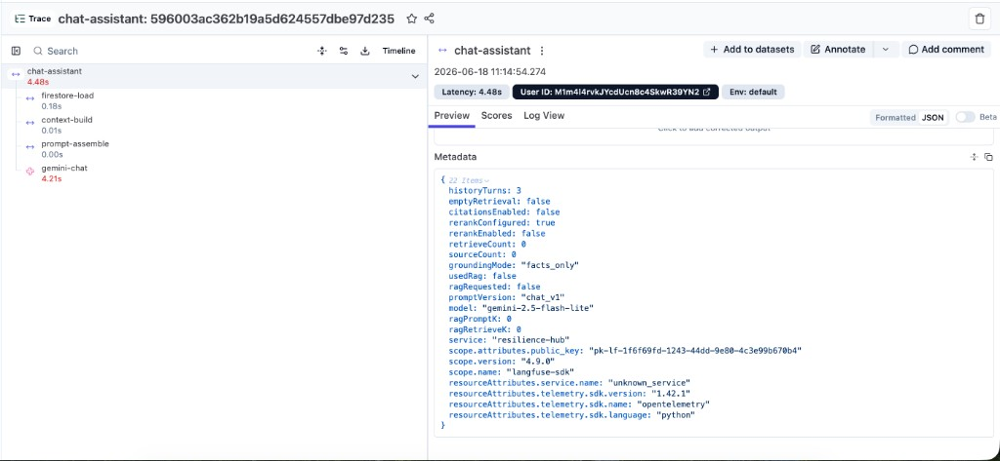
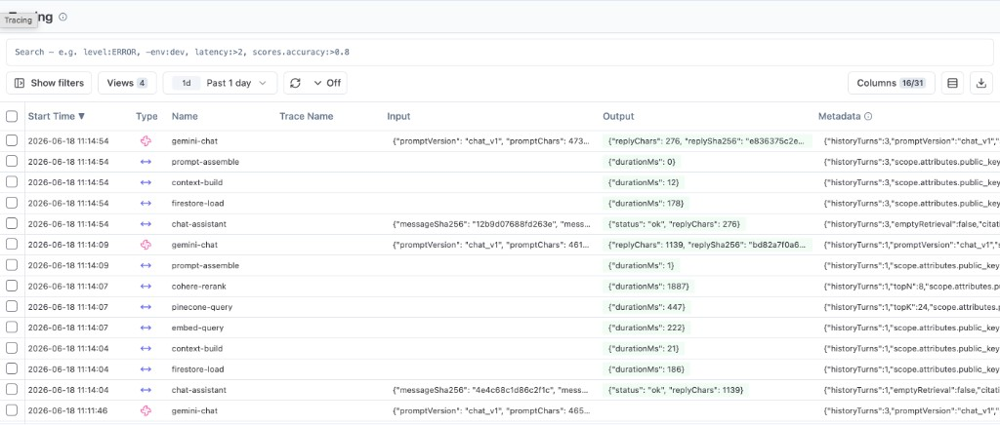

# Observability runbook

Portfolio deliverable: answer **“What happened when chat quality dropped on Tuesday?”** without running full RAGAS on every request.

**Related:** [`chat-assistant-flow.md`](chat-assistant-flow.md) (pipeline), [`portfolio-roadmap.md`](portfolio-roadmap.md) (issue order), [`.env.example`](../.env.example) (env vars).

**Code:** `server/langfuse_tracing.py`, `server/routes/chat.py`, `src/components/ChatAssistant.tsx`.

---

## Quick start

| Signal | Where | When to use |
|--------|--------|-------------|
| **Langfuse traces** | [Langfuse Cloud](https://cloud.langfuse.com) → project → **Tracing** | Per-request timeline, stage latency, user id |
| **Response `meta`** | Browser devtools → `/api/chat-assistant` JSON | Instant grounding flags for one reply |
| **`chat_assistant_quality` logs** | GCP Cloud Logging / local Flask stdout | Aggregate empty-retrieval rate, trends |
| **`chat_assistant stage=…` logs** | Same | Per-stage `duration_ms` when `CHAT_LOG_STAGE_TIMINGS=1` |

Enable Langfuse on Cloud Run: set `LANGFUSE_PUBLIC_KEY`, `LANGFUSE_SECRET_KEY` (and optional `LANGFUSE_HOST`). Omit keys for zero overhead.

---

## Runbook: “Quality dropped Tuesday”

### 1. Confirm the symptom

Pick one failing or weak reply. Note **approximate UTC time**, **Firebase uid** (from Langfuse or server logs), and whether the user expected **memory recall** (RAG) or **facts-only** (counts, active challenges).

In the browser, inspect the chat response `meta`:

| `meta` field | If bad quality on a memory question, look for |
|--------------|-----------------------------------------------|
| `ragRequested` | Should be `true` for “what did I write…” style prompts |
| `emptyRetrieval` | `true` → Pinecone returned nothing (index gap or routing ok, retrieval empty) |
| `usedRag` | `false` with `ragRequested: true` → facts-only fallback |
| `groundingMode` | `facts_only` when no memories in prompt |
| `sourceCount` / `retrieveCount` | 0 vs >0 |
| `promptVersion` | Which template was used (`chat_v1` default) |

### 2. Find the trace (Langfuse)

1. Open [Langfuse Cloud](https://cloud.langfuse.com) → your project → **Tracing**.
2. Filter by **time range** (Tuesday window, UTC).
3. Filter by **User ID** = Firebase `uid` if known.
4. Open a trace named **`chat-assistant`**.

Each trace should show a tree like:

```text
chat-assistant (span)
├── firestore-load
├── context-build
├── embed-query          (RAG only)
├── pinecone-query       (RAG only)
├── cohere-rerank        (RAG only)
├── prompt-assemble
└── gemini-chat          (generation)
```

**Example (production):** trace tree with stage timings and metadata on the root span:



**Observations table** — filter by trace id or time; each row shows `durationMs` on stage outputs (RAG request with embed → Pinecone → rerank):



In the RAG example above, `cohere-rerank` (~1.9s) dominates retrieval latency vs `pinecone-query` (~450ms) and `embed-query` (~220ms). Use this to decide whether rerank is worth the cost for your traffic.

### 3. Walk the pipeline (retrieval → rerank → prompt → reply)

Work top-down on one trace:

| Step | Span / signal | Healthy | Investigate when slow or wrong |
|------|----------------|---------|--------------------------------|
| **Retrieval** | `embed-query` + `pinecone-query` | Present when `ragRequested`; `retrieveCount` > 0 in metadata | Missing keys, index empty, wrong `user_id` filter, embed failure |
| **Rerank** | `cohere-rerank` | Optional; `rerankEnabled: true` when configured | `COHERE_API_KEY` / `RERANK_ENABLED`; latency spike |
| **Prompt** | `prompt-assemble` + `promptVersion` in metadata | Matches deployed `CHAT_PROMPT_VERSION` | Template change, large `promptChars` on generation |
| **Reply** | `gemini-chat` generation | `output.status: ok`, reasonable `replyChars` | Gemini errors → 503; compare `durationMs` across stages |

**Metadata on the root span** mirrors API `meta`: `ragRequested`, `usedRag`, `emptyRetrieval`, `groundingMode`, `sourceCount`, `retrieveCount`, `model`, etc.

**PII:** Langfuse stores **hashes and counts** for message/prompt/reply — not full user text. For verbatim prompt content, use server logs only with strict controls (see [PII policy](#pii-policy) below).

### 4. Correlate with logs (GCP)

In Cloud Logging for service `resilience-hub-api`:

```text
textPayload:"chat_assistant_quality"
```

Example line:

```text
chat_assistant_quality uid=… rag_requested=True empty_retrieval=True grounding_mode=facts_only source_count=0 retrieve_count=0 …
```

**Empty retrieval rate (approx.):** count lines with `empty_retrieval=True` and `rag_requested=True`, divided by count with `rag_requested=True`, over the incident window.

For stage breakdown in logs (no Langfuse):

```text
textPayload:"chat_assistant stage="
```

Requires `CHAT_LOG_STAGE_TIMINGS=1` on the revision.

### 5. Common root causes

| Observation | Likely cause | Action |
|-------------|--------------|--------|
| `emptyRetrieval: true`, RAG questions | User not indexed, Pinecone down, or no matching notes | Check upsert path, index namespace, `PINECONE_*` env |
| `ragRequested: false` on memory question | Intent router (`needs_semantic_retrieval`) | See golden evals in `evals/chat_golden.jsonl` |
| High `gemini-chat` latency only | Model/API | Gemini status, prompt size (`promptChars`) |
| High `pinecone-query` / `embed-query` | Retrieval path | Pinecone region, embed quota |
| `promptVersion` changed mid-week | Deploy / env | Diff `server/prompts/` templates |

---

## Response `meta` reference

Every successful `/api/chat-assistant` response includes `meta` (also copied to Langfuse when tracing is on):

| Field | Meaning |
|-------|---------|
| `promptVersion` | Loaded system prompt template id (e.g. `chat_v1`) |
| `ragRequested` | Intent router asked for semantic retrieval |
| `usedRag` | Numbered memory block was included in the prompt |
| `groundingMode` | `rag` or `facts_only` |
| `emptyRetrieval` | `ragRequested` and Pinecone returned **0** hits |
| `sourceCount` | Citations returned in `sources[]` |
| `retrieveCount` | Pinecone hits before rerank / prompt slice |
| `ragRetrieveK` / `ragPromptK` | Config used this request (0 when RAG off) |
| `rerankEnabled` | Cohere rerank re-ordered hits this request |
| `rerankConfigured` | `COHERE_API_KEY` + `RERANK_ENABLED` present |
| `citationsEnabled` | Model was instructed to use `[n]` markers |

---

## Quality proxy metrics (#85)

| Metric | Definition | Source |
|--------|------------|--------|
| **Empty retrieval rate** | Share of RAG-routed requests with no Pinecone hits | `emptyRetrieval=true` |
| **RAG grounding rate** | RAG-routed requests that used indexed memories | `usedRag=true` |
| **Facts-only fallback rate** | RAG requested but facts-only grounding | `groundingMode=facts_only` + `ragRequested=true` |
| **Citation rate** | Responses with citations | `sourceCount > 0` |

---

## Langfuse tracing (#83)

When `LANGFUSE_PUBLIC_KEY` and `LANGFUSE_SECRET_KEY` are set (and `LANGFUSE_DISABLED` is not truthy), each chat request after auth + rate limit creates **one trace**:

- **User:** Firebase UID via `propagate_attributes(user_id=…)`
- **Input:** SHA-256 digest + char length of user message (no raw text)
- **Pipeline metadata:** fields from `meta` above + `model`
- **Generation:** `gemini-chat` with model id, `promptChars`, `replyChars`, reply digest

Set `LANGFUSE_HOST` for self-hosted Langfuse; default is Langfuse Cloud.

### Per-stage latency spans (#84)

Child spans record `output.durationMs`:

| Span | When |
|------|------|
| `firestore-load` | Firestore `users/{uid}` read |
| `context-build` | `build_assistant_facts` + `prompt_context_json` |
| `embed-query` | Gemini query embedding (RAG only) |
| `pinecone-query` | Pinecone vector search (RAG only) |
| `cohere-rerank` | Cohere rerank (RAG only) |
| `prompt-assemble` | Versioned system prompt render |
| `gemini-chat` | Gemini generation |

**Percentiles:** Langfuse **Metrics** / observation analytics expose latency percentiles by observation name when volume is sufficient. For ad-hoc debugging, use `CHAT_LOG_STAGE_TIMINGS=1`.

Screenshots: [trace tree](images/observability/langfuse-trace-tree.png), [spans table](images/observability/langfuse-spans-table.png).

---

## Environment variables

Authoritative list: [`.env.example`](../.env.example).

### Langfuse

| Variable | Purpose |
|----------|---------|
| `LANGFUSE_PUBLIC_KEY` | Project public key |
| `LANGFUSE_SECRET_KEY` | Project secret key |
| `LANGFUSE_HOST` | Optional; default Langfuse Cloud |
| `LANGFUSE_DISABLED` | `1` to force tracing off |

### Chat logging & timing

| Variable | Purpose |
|----------|---------|
| `LOG_LEVEL` | e.g. `DEBUG` for verbose logs |
| `CHAT_LOG_PROMPT_PREVIEW_CHARS` | Log first N chars of assembled prompt at INFO |
| `CHAT_LOG_FULL_PROMPT` | `1` = log full prompt at INFO (**PII**) |
| `CHAT_LOG_STAGE_TIMINGS` | `1` = log `chat_assistant stage=… duration_ms=…` |

### RAG & model (affect quality signals)

| Variable | Purpose |
|----------|---------|
| `GEMINI_API_KEY` | Chat + embeddings |
| `PINECONE_API_KEY`, `PINECONE_INDEX_NAME` | Retrieval; missing → empty matches |
| `RAG_RETRIEVE_K`, `RAG_PROMPT_K` | Retrieve width vs prompt slice |
| `CHAT_PROMPT_VERSION` | Prompt template id |
| `COHERE_API_KEY`, `RERANK_ENABLED`, `RERANK_MODEL` | Rerank stage |

### Rate limits (cost / abuse)

| Variable | Purpose |
|----------|---------|
| `CHAT_UID_RATE_CAPACITY`, `CHAT_UID_RATE_REFILL_PER_SEC` | Per-user token bucket |
| `CHAT_IP_RATE_CAPACITY`, `CHAT_IP_RATE_REFILL_PER_SEC` | Per-IP token bucket |

---

## PII policy

| Data | Langfuse trace | Server logs (default) | API response |
|------|----------------|----------------------|--------------|
| User message text | **No** (SHA-256 + length only) | Avoid unless `CHAT_LOG_FULL_PROMPT` / DEBUG | In `reply` only |
| Full system prompt | **No** (`promptChars` only) | Preview/full only if env enabled | No |
| Firebase uid | **Yes** (`user_id`) | In `chat_assistant_quality` lines | No |
| Journal / note content in RAG | **No** | May appear in full prompt logs | `sources[].snippet` only |

**Production guidance:** keep `CHAT_LOG_FULL_PROMPT` unset; use Langfuse + `meta` for grounding debugging. Enable prompt preview only temporarily during incidents.

---

## Cost tracking

Rough cost drivers per chat request:

| Stage | Billed service | Notes |
|-------|----------------|-------|
| `embed-query` | Gemini embedding | RAG-routed requests only |
| `gemini-chat` | Gemini `gemini-2.5-flash-lite` | Every successful chat |
| `pinecone-query` | Pinecone | Read units by index plan |
| `cohere-rerank` | Cohere | When `rerankEnabled` |
| Langfuse | Langfuse Cloud | Observation ingest; no model cost |

**In-app caps:** UID + IP rate limits reduce runaway spend. **Langfuse** can show generation counts and latency; use GCP billing + provider dashboards for dollar amounts.

**Offline eval cost:** see [`evals/README.md`](../evals/README.md) before running live golden evals. RAGAS reference baseline: [`evals/ragas_baseline.json`](../evals/ragas_baseline.json).

---

## Server logs (non-Langfuse)

Existing structured lines:

- `chat_assistant prompt_build …` — prompt size breakdown
- `chat_assistant grounding …` — routing summary
- `chat_assistant_quality …` — quality proxies (#85)

Controlled via `.env` (see above). Treat full prompt logs as **sensitive**.
