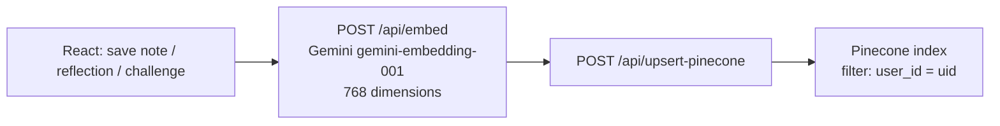

# RAG indexing: chunking policy

How user text becomes **vectors in Pinecone** (write path) and how chat **retrieves** them (read path). Chunking is implemented in **#76** (`server/text_chunking.py`, `server/index_content.py`). This doc describes **current behavior** and env tuning.

**Related:** [`chat-assistant-flow.md`](chat-assistant-flow.md) (query-time RAG), [`portfolio-roadmap.md`](portfolio-roadmap.md) (issue order).

---

## Summary

| | **Behavior** |
|---|-------------|
| **Granularity** | **One or more vectors** per logical item (`note`, `reflection`, `challenge`) |
| **When to chunk** | Text longer than **`RAG_CHUNK_THRESHOLD_CHARS`** (default **2000** chars ≈ ~500 tokens) |
| **Chunk size** | Target **`RAG_CHUNK_TARGET_CHARS`** (default **2000**), overlap **`RAG_CHUNK_OVERLAP_CHARS`** (default **400**) |
| **Metadata** | `parent_id`, `chunk_index`, `chunk_count`, per-chunk `content` |
| **Vector ids** | `{parent_id}-c0`, `{parent_id}-c1`, … |
| **Deletes** | `parentId` on delete API → removes all `{parentId}-c*` vectors; note edits also delete legacy `vectorId` |

**Legacy:** clients may still POST a precomputed **`vector`** (single upsert, timestamp id) without chunking.

**Preferred:** POST **`content`** + **`metadata`** — server splits, embeds each chunk, replaces prior chunks for the same `parent_id`.

---

## Write path (indexing)

### What gets indexed today

| Source | Client helper | Embedded text | `metadata.type` |
|--------|---------------|---------------|-----------------|
| Challenge save / progress | `upsertChallengeData` (`src/services/pinecone.ts`) | Short **summary** string (name, cadence, progress) | `challenge` |
| Challenge day note | `upsertNoteData` / `updatePineconeNote` (`src/utils/api.ts`) | **Full note body** | `note` |
| Daily reflection | `upsertDailyReflection` | **Full reflection text** | `reflection` |

Firestore remains the **source of truth**; Pinecone is a **mirror** for semantic search. Upsert failures are logged and do not block UI saves.

### Server: `/api/upsert-pinecone`

**Code:** `server/routes/pinecone.py`, `server/index_content.py`

**Content path (preferred):**

1. Firebase bearer auth → verified `uid`.
2. Sanitize `metadata`; require fields needed for **`parent_id`** (e.g. `challengeId` + `dayNumber` for notes).
3. Delete existing vectors with id prefix `{parent_id}-c`.
4. **`split_text_for_indexing(content)`** → chunk strings.
5. **`embed_query_text`** per chunk → batch **`upsert`**.
6. Response: **`vectorId`** = `{parent_id}-c0`, **`parentId`**, **`chunkCount`**.

**Legacy vector path:** client sends **768-dim** `vector` + `metadata` → single upsert with timestamp id (unchanged for old clients/tests).

**Allowed metadata keys:** `type`, `challengeId`, `challengeName`, `dayNumber`, `content`, `date`, `dateCreated`, `completionDate`, `parent_id`, `chunk_index`, `chunk_count` (plus server-added `user_id`).

### Server: `/api/embed`

**Code:** `server/routes/embed.py`, `server/gemini_client.py`

- Model: **`gemini-embedding-001`**
- Output: **768** floats (must match Pinecone index dimension and client `embeddings.ts`).

### Deletes

**Code:** `POST /api/delete-pinecone` (`server/routes/pinecone.py`)

- **`vectorId`**: delete one vector (must start with `{uid}-`).
- **`parentId`**: delete all chunk vectors `{parentId}-c*`.
- **`prefix`**: delete all vectors whose id starts with the prefix after a filtered query.

Note edits call `updatePineconeNote`: delete legacy `vectorId` if present, delete by **`parentId`**, then content upsert (replaces all chunks).

---

## Read path (chat)

**Code:** `server/routes/chat.py`, `server/intent_chat.py`, `server/rerank.py`

1. **`needs_semantic_retrieval(message)`** — memory-style questions → RAG; aggregate/count questions → facts + rich context only ([`intent_chat.py`](../server/intent_chat.py)).
2. If RAG: **embed the user message** (same 768-dim model) → Pinecone **query** with `filter: { user_id: uid }`, `top_k = RAG_RETRIEVE_K` (default **24**).
3. Optional **Cohere rerank** → keep top **`RAG_PROMPT_K`** (default **8**) for prompt + `sources[]`.
4. Matches formatted as numbered lines `[1] type (date): text` for citations ([#74](https://github.com/vectorvoyager358/resilience-hub/issues/74)).
5. If RAG requested but **no matches**: facts-only grounding fragment ([#75](https://github.com/vectorvoyager358/resilience-hub/issues/75)) — no `[n]` citations.

**Caps on retrieved text (current):**

| Stage | Limit |
|-------|--------|
| Match `content` in chat route | **4000** chars per hit |
| `sources[].snippet` in JSON | **320** chars (`CHAT_SOURCE_SNIPPET_CHARS`) |

These limits apply **per vector**, not per logical document. After chunking (#76), one note may surface as several adjacent chunks in top-K results; rerank and `prompt_k` reduce how many reach the model.

---

## Chunking policy (implemented)

**Code:** `server/text_chunking.py`, `server/index_content.py`

| `parent_id` pattern | Types |
|---------------------|--------|
| `{uid}-note-{challengeId}-{dayNumber}` | Challenge day notes |
| `{uid}-reflection-{date}` | Daily reflections |
| `{uid}-challenge-{challengeId}` | Challenge summary rows |

Splitting prefers **paragraph** and **sentence** boundaries inside the target window. Read path is unchanged: top-K may return multiple chunks from one note; tune **`RAG_RETRIEVE_K` / `RAG_PROMPT_K`** and rerank as needed. Optional future: dedupe by `parent_id` before prompt assembly.

---

## Environment variables (indexing + retrieval)

| Variable | Role |
|----------|------|
| `GEMINI_API_KEY` | Embeddings + chat |
| `PINECONE_API_KEY`, `PINECONE_INDEX_NAME` | Index read/write |
| `PINECONE_RATE_*` | Upsert/delete rate limits |
| `RAG_RETRIEVE_K`, `RAG_PROMPT_K` | Query width vs prompt/sources depth |
| `COHERE_API_KEY`, `RERANK_*` | Optional rerank before prompt |
| `CHAT_SOURCE_SNIPPET_CHARS` | API snippet size |
| `RAG_CHUNK_THRESHOLD_CHARS` | Min length before splitting (default `2000`) |
| `RAG_CHUNK_TARGET_CHARS` | Target chunk size (default `2000`) |
| `RAG_CHUNK_OVERLAP_CHARS` | Overlap between chunks (default `400`) |

See [`.env.example`](../.env.example) and [`chat-assistant-flow.md`](chat-assistant-flow.md) §7.
