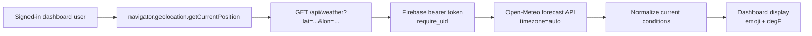

# Dashboard weather flow

This page documents the lightweight weather feature shown beside the daily reflection date on the dashboard. The browser gets the user's current coordinates, the Flask API proxies current conditions from Open-Meteo, and the dashboard renders an emoji plus Fahrenheit temperature.

**Primary code:** `src/pages/DashboardPage.tsx`, `src/api/http.ts`, `src/utils/authFetch.ts`, `server/routes/weather.py`, `tests/backend/test_weather.py`.

## 1. End-to-end flow



1. `DashboardPage` starts the weather load only when `currentUser.uid` exists.
2. The browser asks for location through `navigator.geolocation`. Coordinates stay in-memory in the current request path; this flow does not write location to Firestore.
3. The client calls `authedGetJsonOptional('/api/weather?...')`, which resolves the API base with `apiUrl`, attaches `Authorization: Bearer <Firebase ID token>`, and treats HTTP/network errors as recoverable UI states.
4. `server.routes.weather.current_weather` verifies the bearer token with `require_uid`, validates latitude/longitude ranges, and queries Open-Meteo with `timezone=auto` and `current=temperature_2m,weather_code,is_day`.
5. The server returns normalized JSON. The dashboard renders `emojis` from the server when present, converts Celsius to Fahrenheit client-side, and shows retry/help text for geolocation or API failures.

## 2. API contract

### Request

```http
GET /api/weather?lat=52.52&lon=13.41
Authorization: Bearer <Firebase ID token>
```

Constraints:

- `lat` must parse as a number in `[-90, 90]`.
- `lon` must parse as a number in `[-180, 180]`.
- The route is authenticated but read-only; it does not use the UID for storage.
- No API key is required for Open-Meteo in the current implementation.

### Success response

```json
{
  "temperatureC": 12.4,
  "weatherCode": 3,
  "isDay": true,
  "observationTimeLocal": "14:00",
  "emojis": "🌞☁️"
}
```

Field notes:

| Field | Source / behavior |
|-------|-------------------|
| `temperatureC` | Open-Meteo `current.temperature_2m`, rounded to one decimal. |
| `weatherCode` | Open-Meteo WMO `current.weather_code`, coerced to an integer. |
| `isDay` | Open-Meteo `current.is_day`; if missing, inferred from `observationTimeLocal` (`06:00 <= hour < 19:00`), otherwise defaults to `true`. |
| `observationTimeLocal` | `current.time` formatted as `HH:MM` in Open-Meteo's returned timezone, or `null` if parsing fails. |
| `emojis` | Server display string derived from WMO weather code plus day/night. `DashboardPage` has a matching fallback for older Flask deployments that omit this field. |

### Error responses

| Status | Body | Common cause |
|--------|------|--------------|
| `401` | `{"error": "unauthorized"}` | Missing, malformed, expired, or invalid Firebase ID token. |
| `400` | `{"error": "invalid lat or lon"}` | Query params are missing or not numeric. |
| `400` | `{"error": "lat or lon out of range"}` | Coordinates parsed but are outside valid ranges. |
| `502` | `{"error": "weather_unavailable"}` | Open-Meteo request failed, returned invalid JSON, or omitted required current-condition fields. |

## 3. Dashboard UI states

`reflectionWeatherPhase` in `DashboardPage` drives the user-visible state:

| Phase | What the user sees |
|-------|---------------------|
| `idle` | No weather request has started, usually because there is no signed-in user yet. |
| `loading` | `Checking the weather...` with a spinner. |
| `geo_denied` | Prompt to allow location and a `Try again` button. |
| `geo_error` | Location could not be detected and a retry button is available. |
| `api_error` | Weather could not be loaded and a retry button is available. |
| `ready` | Weather emoji(s) and Fahrenheit temperature. |

The request sequence ref (`reflectionWeatherRequestSeq`) prevents stale geolocation callbacks from updating state after a retry, sign-out, or React Strict Mode remount.

## 4. Setup and deployment notes

- Local development uses the same `/api` path as other Flask routes. Leave `VITE_API_BASE_URL` empty so Vite proxies `/api` to `http://localhost:5001`.
- In production, set `VITE_API_BASE_URL` to the Cloud Run origin and include the frontend origin in backend `ALLOWED_ORIGINS`.
- Browser geolocation requires a secure context in production (`https://`). `localhost` is the usual development exception.
- The backend route uses the Python standard library for HTTP and `zoneinfo`; no weather-specific package or secret is configured.
- The feature is intentionally best effort. Dashboard and daily reflections continue to work when geolocation is denied or Open-Meteo is unavailable.

## 5. Troubleshooting

- **Dashboard says "Allow this site to use your location"**: Location permission is denied or blocked at the browser/site level. Re-enable permission and click `Try again`.
- **Dashboard says weather could not be loaded**: Check the Flask logs for `open-meteo forecast failed`, confirm the API can reach `https://api.open-meteo.com`, and verify `ALLOWED_ORIGINS` / `VITE_API_BASE_URL` if the browser call is cross-origin.
- **401 from `/api/weather`**: Confirm the user is signed in and `auth.currentUser.getIdToken()` succeeds. Unlike `/api/chat-assistant`, this route does not require email verification; it only requires a valid bearer token.
- **Wrong day/night emoji**: Open-Meteo `is_day` is authoritative when present. If it is absent, both server and dashboard fallback use the local observation hour heuristic (`06:00` through `18:59` is day).

## 6. Tests

`tests/backend/test_weather.py` mocks external HTTP and Firebase token verification. It covers:

- Successful Open-Meteo normalization.
- Day/night handling from `is_day` and local-clock fallback.
- Unauthorized requests.
- Invalid latitude/longitude input.

Run the backend suite from the repository root:

```bash
npm run test:server
```
